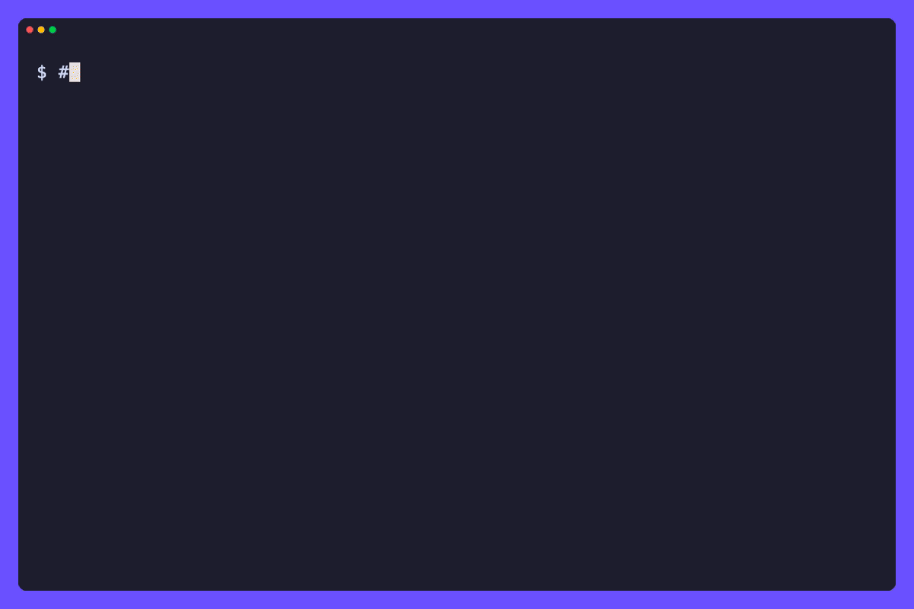

# tomo (友)

[](https://github.com/tamnd/tomo/actions/workflows/ci.yml)
[](https://github.com/tamnd/tomo/releases/latest)
[](https://pkg.go.dev/github.com/tamnd/tomo)
[](https://goreportcard.com/report/github.com/tamnd/tomo)
[](./LICENSE)

**tomo** (友, "companion") is a personal AI agent that lives on your own machine, one static Go binary, no server you don't run yourself. It sits between your chat apps and a language model: you text it on Telegram, Discord, Slack, or iMessage, or open the local web chat, and it remembers you across conversations and acts on real tools, running commands, reading and writing files, fetching pages, saving its own memory, scheduling work for later.

[Install](#install) • [Quick start](#quick-start) • [Models](#models) • [What it does](#what-it-does) • [Docs](https://tomo.tamnd.com/) • [Safety](https://tomo.tamnd.com/guides/policy-and-safety/)



Most agent tools ask you to hand over your history, your files, and your provider key to somebody else's server. tomo doesn't. It runs where you run it, keeps its state in a sqlite file and a folder of plain markdown next to it, and the only thing that leaves your machine is the model call you would have made anyway. Every action it takes passes a fail-closed policy gate first, and the moment a turn pulls in content from outside (a fetched page, a tool's output), the session is tainted, so an injected instruction in that content can't quietly reach your shell.

## Install

```sh
go install github.com/tamnd/tomo/cmd/tomo@latest
```

Prefer a prebuilt binary? Grab an archive, a `.deb`/`.rpm`/`.apk`, or a checksum from [releases](https://github.com/tamnd/tomo/releases). A container image ships too:

```sh
docker run --rm -it -v ~/.tomo:/root/.tomo ghcr.io/tamnd/tomo chat
```

Check what you got with `tomo version`, which prints the build's commit and date alongside the version, not just a bare number.

## Quick start

```sh
tomo onboard   # writes ~/.tomo/config.yaml and walks you through a provider
tomo chat      # talk from the terminal
tomo serve     # web chat on localhost, plus every channel you configured
```

That's the whole loop: pick a provider once, then talk to tomo from wherever you already are. `tomo -p "summarize CHANGES.md"` runs one prompt non-interactively and exits, for scripts and pipelines.

## Models

tomo is model-agnostic. The Anthropic API is native, and anything speaking the OpenAI chat completions dialect works through `base_url`: a local llama.cpp or ollama, a LAN inference box, or any hosted gateway.

```yaml
default_model: anthropic/claude-fable-5
providers:
  anthropic:
    type: anthropic
    api_key: ${ANTHROPIC_API_KEY}
  local:
    type: openai
    base_url: http://gamingpc:8000/v1
    api_key: ${LOCAL_API_KEY}
```

A model is named `provider/model`, so the `local` provider above serves models like `local/qwen2.5-coder`. Set `default_model` to any of them, or override it per worker.

## What it does

- **Speaks through the chat apps you already use.** The local web chat is always on; Telegram, Discord, Slack, and iMessage start when you configure them, each with its own allow-list.
- **Acts with real tools, behind a gate.** Reads and network calls run on their own; writes and code execution ask first, and anything you haven't allowed is declined outright. Once a turn pulls in untrusted content, writes and execution escalate to ask even if they were previously allowed. An optional OS-level sandbox can bound an approved command to its working tree and off the network entirely.
- **Remembers you across conversations.** A markdown memory tomo reads and writes itself, with a curator that reflects after substantial turns and stamps each note with where it came from, so you can read your own agent's notes about you.
- **Gets better at your workflows.** It follows skills you write and drafts new ones from workflows it sees you repeat. Installing a drafted skill is always your call, never automatic.
- **Works on its own when you want.** Scheduled prompts and a heartbeat pick up standing work on a cadence and report back only when there's something worth saying.
- **Runs many agents when one isn't enough.** Named workers with their own persona, model, policy, and memory, routed by `@name` or by channel, and one worker can hand a task off to another.
- **Speaks and listens.** Optional local voice: whisper transcribes voice notes in, piper speaks replies back, all on your machine.
- **Talks to other tools over MCP.** Attach MCP servers to extend its toolset, or serve tomo's own tools to Claude Code and other MCP clients.

## How it's built

```
chat message ─▶ channel adapter ─▶ gateway daemon ─▶ policy gate ─▶ tool ─▶ reply
                (Telegram, etc)     (owns the session)  (allow/ask/deny)
```

A gateway daemon owns sessions in a sqlite ledger. Channel adapters are thin: they turn a platform's messages into events and render replies back, nothing more. Tools are typed and classified (read, net, write, exec), and a policy engine decides allow, ask, or deny on every call, with approvals answered right in the channel you're talking on. Memory is plain markdown you can read and edit yourself, no vector store to inspect.

## Building from source

```sh
git clone https://github.com/tamnd/tomo
cd tomo
go build -o bin/tomo ./cmd/tomo
go test ./...
```

The repo is split by concern:

```
cmd/tomo/    thin main: wires signal handling, then hands off to cli.Execute
cli/         the cobra command tree, flags, and version reporting
pkg/agent/   the turn loop: model call, tool dispatch, policy check
pkg/policy/  the allow/ask/deny gate and the taint tracking
pkg/channel/ Telegram, Discord, Slack, iMessage, and the local web chat
pkg/tool/    the built-in tool surface: shell, files, fetch, memory
pkg/memory/  the markdown memory store and its curator
pkg/schedule/ cron-style scheduled prompts and the heartbeat
pkg/mcp/     MCP client (attach servers) and MCP server (serve tomo's tools)
pkg/provider/ model providers: Anthropic native, OpenAI-compatible via base_url
pkg/wire/    stdlib-only translators between chat-completions and other LLM
             wires (Anthropic Messages, OpenAI Responses, Gemini)
pkg/sandbox/ the optional OS-level exec sandbox
pkg/store/   the sqlite session ledger
docs/        the tago documentation site, published at tomo.tamnd.com
```

## Releasing

Push a version tag and GitHub Actions runs GoReleaser, which builds the archives, the `.deb`/`.rpm`/`.apk` packages, a multi-arch GHCR image, checksums, and a cosign signature:

```sh
git tag v0.3.0
git push --tags
```

Full documentation, including the [policy and safety](https://tomo.tamnd.com/guides/policy-and-safety/) model in full, lives at [tomo.tamnd.com](https://tomo.tamnd.com/).

## License

MIT
